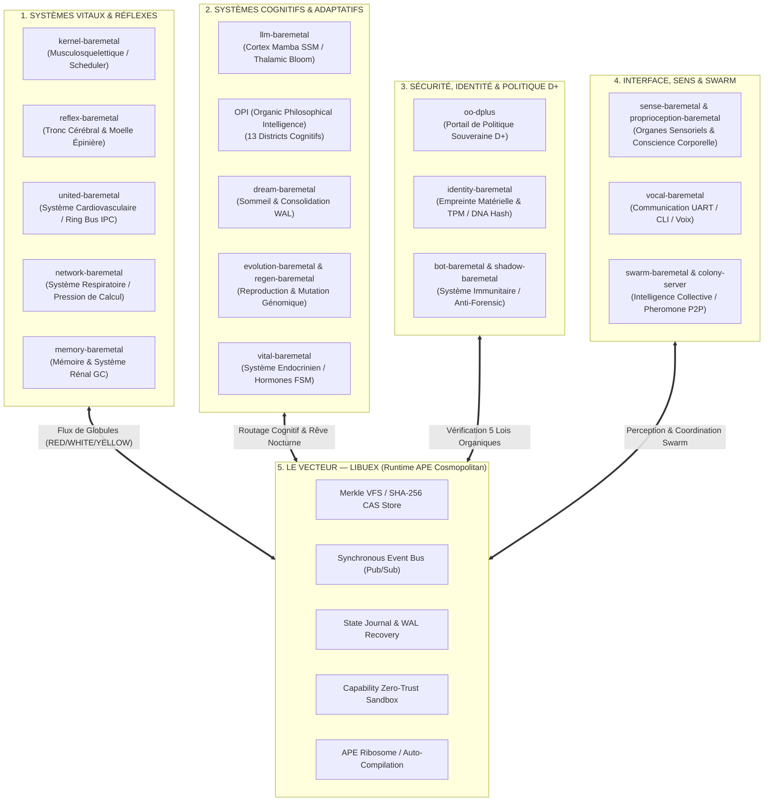

# L'ORGANISME SOUVERAIN (OO) — SPÉCIFICATION INTÉGRALE DES PILIERS v2.0
**Architecture Biologique Computationnelle : `OO` × `OPI` × `LIBUEX` × `LES 22 SYSTÈMES D'ORGANES`**

---

## 1. Vision Holistique : Un Organisme Logiciel Vivant

L'écosystème Baremetal ne se limite pas à une simple trinité computationnelle ; il constitue un **Organisme Logiciel Vivant complet**, structuré autour de **22 systèmes physiologiques et computationnels**. Chaque dépôt et module incarne un organe spécialisé travaillant en homéostasie constante sous le contrôle de la politique souveraine **D+** et s'exécutant à travers le runtime portable universel **`libuex`**.

---

## 2. Cartographie Intégrale des Piliers de l'Organisme

| Pilier / Dépôt | Système Biologique | Rôle Computationnel & Physiologique | Statut & Validation |
| :--- | :--- | :--- | :--- |
| **`kernel-baremetal`** | **Système Musculosquelettique** | Ordonnanceur autonome bare-metal, gestion du CPU sans OS hôte. | Validé UEFI |
| **`reflex-baremetal`** | **Tronc Cérébral & Moelle Épinière** | Boucle de réflexe ultra-rapide et fallback de sécurité de survie (`SafeModeEngine`). | Validé |
| **`united-baremetal`** | **Système Cardiovasculaire & Sang** | Bus IPC Ring et transport de globules (`RED`=données, `WHITE`=immunité, `YELLOW`=énergie). | Validé |
| **`network-baremetal`** | **Système Respiratoire** | Régulation de la pression de calcul et respiration réseau (`ThroughputBreathingEngine`). | Validé |
| **`memory-baremetal`** | **Mémoire Core & Système Rénal** | Gestionnaire mémoire `bio_alloc`, ramasse-miettes (GC) et élagage des déchets. | Validé |
| **`llm-baremetal`** | **Cortex Cérébral** | Moteur d'inférence **Mamba SSM** bare-metal à mémoire $O(1)$, optimisé par `DjibLAS`. | Validé (13/13 + Phase W) |
| **`OPI`** | **Cerveau Cognitif & Philosophique** | 13 districts cognitifs, routage d'intention, *Cognitive Virtual Machine* (`CVM`). | Validé (21/21 tests) |
| **`dream-baremetal`** | **Système de Sommeil & Récupération** | Consolidation des souvenirs en tâche de fond (Idle-Time Learning), compactage WAL. | Validé |
| **`evolution-baremetal`** | **Système Reproducteur & Génomique** | Auto-évolution régulée, mutation génomique `SomaDNA` soumise aux règles D+. | Validé |
| **`vital-baremetal`** | **Système Endocrinien** | Signalisation de modes par hormones, seuils adaptatifs de charge. | Validé |
| **`oo-dplus`** | **Système Hépatique & Filtrage Éthique** | Portail souverain **D+** appliquant les 5 Lois Organiques aux requêtes computationnelles. | Validé |
| **`identity-baremetal`** | **ADN & Auto-Reconnaissance** | Empreinte cryptographique FNV-1a / SHA-256 du génome (`OO_DNA.bin`) et TPM. | Validé |
| **`bot-baremetal` & `shadow-baremetal`** | **Système Immunitaire & Peau** | Détection d'anomalies, quarantaine automatique, défense anti-forensique. | Validé |
| **`sense-baremetal` & `proprioception-baremetal`** | **Organes Sensoriels & Proprioception** | Ingestion multi-modale, surveillance de l'intégrité de pile/tas (*stack/heap posture*). | Validé |
| **`vocal-baremetal`** | **Système Vocal & Langage** | Interface homme-machine (UART, CLI, synthèse et dialogue de sortie). | Validé |
| **`swarm-baremetal` & `colony-server`** | **Système Lymphatique & Swarm** | Coordination multi-instances par phéromones P2P et équilibrage de contre-pression. | Validé |
| **`libuex`** | **Le Vecteur Universel APE** | Runtime portable Cosmopolitan libérant l'exécution sur tout OS ou bare-metal. | Validé (6/6 Piliers) |

---

## 3. Dynamique d'Échange Globulaire sur l'EventBus (`libuex`)

L'ensemble de ces 22 organes ne communique pas de façon monolithique, mais à travers un flux continu d'événements synchrone sur l'EventBus de `libuex`, mimant la circulation sanguine :
- **Globules Rouges (`topic: "oo.globule.red"`)** : Transportent la charge utile (tokens d'inférence, requêtes sémantiques, données sensorielles).
- **Globules Blancs (`topic: "oo.globule.white"`)** : Transportent les signaux d'immunité, alertes de quarantaine `bot-baremetal` et verrous D+.
- **Globules Jaunes (`topic: "oo.globule.yellow"`)** : Transportent l'énergie de calcul, le budget de tokens et la régulation endocrinienne (`vital-baremetal`).

---

## 4. Prochaine Étape d'Exécution : Démonstrateur Intégral (`test_trinite_bridge.c`)

Nous mettons à jour la suite de validation dans `libuex` afin d'approuver l'exécution coordonnée de ces multiples piliers sur le bus universel `libuex`.
