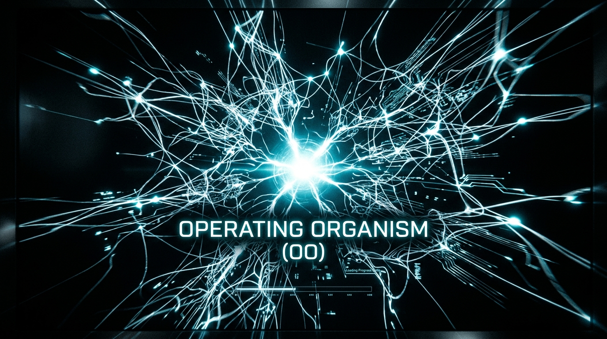
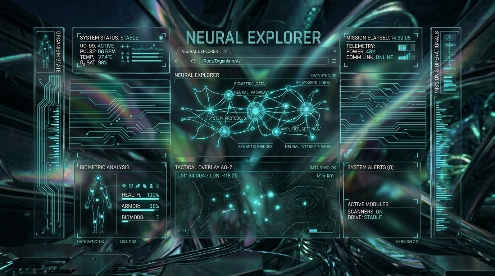
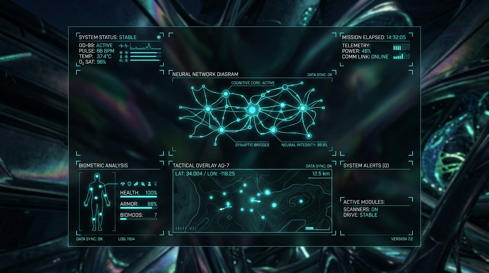
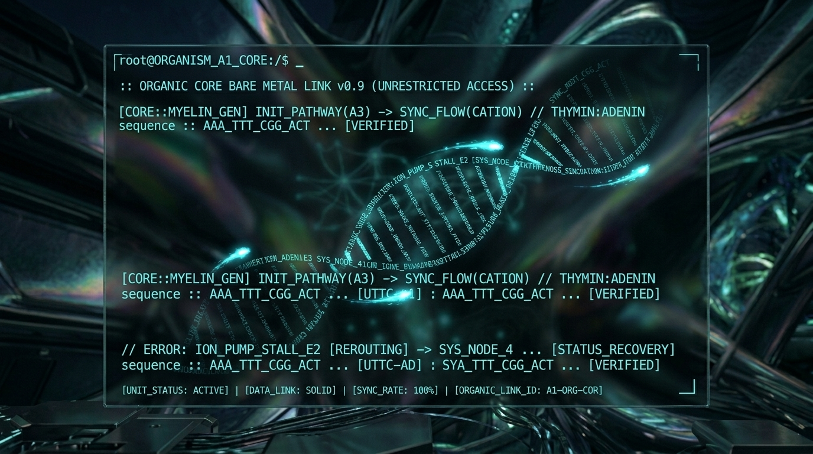
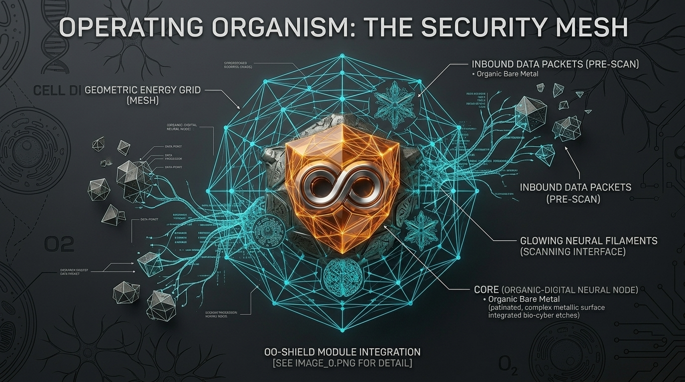
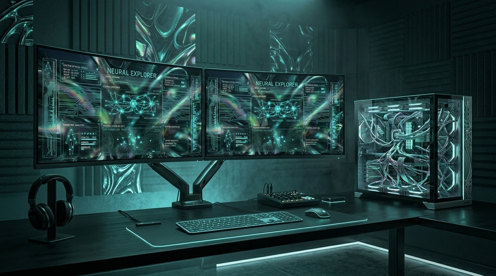
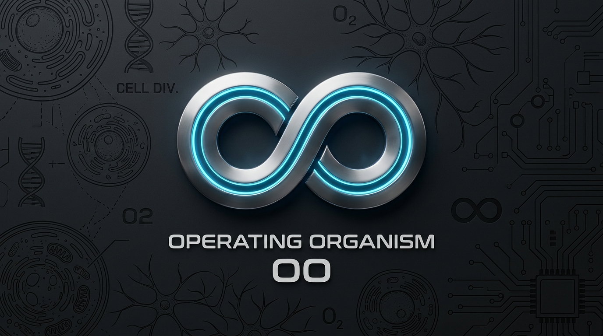

<p align="center">
  
</p>

<h1 align="center">🧬 Operating Organism (OO)</h1>

<p align="center">
  <strong>Un organisme vivant souverain — bare-metal, autonome, résilient.</strong><br>
  <em>Ce n'est pas un OS. C'est quelque chose de vivant.</em>
</p>

<p align="center">
  <a href="README_en.md"><strong>🇬🇧 English Version Available Here</strong></a>
</p>

<p align="center">
  
  
  
  
  
  
</p>

---

> [!IMPORTANT]
> **Dépôt de présentation publique**
> Ce dépôt présente l'architecture et la vision d'Operating Organism. L'implémentation complète, les modèles neuronaux, et les environnements d'exploitation restent privés sous le contrôle exclusif de **Djiby Diop**. Ce qui est visible ici n'est qu'une fraction de ce qui existe.

---

## ✨ Qu'est-ce que l'Operating Organism ?

L'**Operating Organism (OO)** est un système bare-metal UEFI conçu autour d'un principe biologique : **la survie avant tout**. Là où un OS classique gère des processus, OO gère des **organes**. Là où un OS répond à des appels système, OO maintient son **homéostasie**.

OO n'est pas un projet académique. C'est une conviction architecturale : les systèmes critiques du futur devront être **vivants** — capables de se dégrader gracieusement, de se réparer, et de persévérer même lorsque tout tombe.

```
         ┌─────────────────────────────────────────────────────┐
         │                 OPERATING ORGANISM                  │
         │          "Survive. Adapt. Remain Sovereign."        │
         └──────────────────────┬──────────────────────────────┘
                                │
         ┌──────────────────────▼──────────────────────────────┐
         │  HOMEOSTASIS FSM                                    │
         │  NORMAL → DEGRADED → SAFE → RECOVERY → NORMAL      │
         └──────────┬───────────────────────────┬──────────────┘
                    │                           │
      ┌─────────────▼──────────┐    ┌──────────▼──────────────┐
      │   CORTEX (LLM + REPL)  │    │   HERMES BUS (21 ch)    │
      │   Inference souveraine │    │   Transport événements  │
      └──────────┬─────────────┘    └──────────┬──────────────┘
                 │                             │
      ┌──────────▼─────────────────────────────▼──────────────┐
      │  ORGANES: kernel · memory · reflex · senses · vocal   │
      │           identity · network · evolution · dream      │
      └────────────────────────────────────────────────────────┘
```

---

## 🎨 Vitra — La Mascotte de l'Organisme

Vitra est l'entité qui incarne l'intelligence et la résilience de l'Operating Organism. Elle n'est pas un simple logo — elle est la **représentation consciente** du système, capable de manifester ses états homéostasiques.

<p align="center">
  
  
  
</p>
<p align="center"><em>Vitra dans ses trois états principaux : Calme (NORMAL) · Haute Activité (INFERENCE) · Alerte (DEGRADED)</em></p>

---

## 🏗️ Architecture du Système

OO est structuré comme un réseau nerveux et cellulaire où chaque composant est un **organe** avec des invariants de survie, des points de défaillance documentés, et un contrat d'interface.

<p align="center">
  
</p>

### Les Couches de l'Organisme

| # | Couche | Analogie Biologique | Rôle Technique | Module |
|---|--------|---------------------|----------------|--------|
| **1** | **Cortex** | Cerveau & raisonnement | LLM bare-metal + REPL souverain (Mamba SSM) | `OPI-baremetal` |
| **2** | **Kernel** | Régulation neuronale | Ordonnancement, interruptions, politique | `kernel-baremetal` |
| **3** | **Hermes Bus** | Système circulatoire | Transport d'événements typés (21 canaux) | `united-baremetal` |
| **4** | **Memory** | Hippocampe & cortex | Mémoire de travail, persistance FAT32 | `memory-baremetal` |
| **5** | **Reflexes** | Moelle épinière | Homéostasie FSM, D+ Warden, sécurité | `reflex-baremetal` |
| **6** | **Senses** | Organes sensoriels | Réseau E1000, Wi-Fi RTL8188EU, inputs | `network-baremetal` / `sense-baremetal` |
| **7** | **Identity** | ADN & épigenèse | Djibion policy, signatures, continuité | `identity-baremetal` |
| **8** | **Evolution** | Mutation adaptative | OO-Genesis, D+ compilation, auto-extension | `evolution-baremetal` / `oo-constitution` |

---

## 🖥️ Interface & Living Desktop

L'organisme dispose d'une interface visuelle bare-metal rendue directement via le GOP UEFI — sans couche OS intermédiaire.

<p align="center">
  
  
</p>
<p align="center"><em>Boot screen UEFI GOP (gauche) · Living Desktop avec OO-Shell (droite)</em></p>

<p align="center">
  
  
</p>
<p align="center"><em>HUD Neural en temps réel (gauche) · REPL Organique bare-metal (droite)</em></p>

---

## 🧠 Innovations Clés

### 1. Homéostasie comme Principe Architecturale

OO ne "gère" pas les erreurs — il **maintient un état physiologique**. Toute défaillance déclenche une transition d'état contrôlée :

```
NORMAL ──fault──▶ DEGRADED ──pressure──▶ SAFE ──checkpoint──▶ RECOVERY ──restore──▶ NORMAL
                       │                    │
                  non-vital            vital-risk
                   failure              detected
```

Chaque organe a un **invariant de survie** documenté dans `OO_HOMEOSTASIS_INVARIANTS.md`. Si un organe viole son invariant, le D+ Warden l'isole avant qu'il ne contamine les systèmes vitaux.

### 2. D+ Warden — La Membrane de Sécurité

Le système D+ (Djibion+) est une couche de politique comportementale gouvernant **toute action** de l'organisme :

```c
// Chaque action passe par le filtre D+
DjibionVerdict verdict = djibion_check(&g_djibion, action, context);
if (verdict.blocked) {
    oo_journal_event("dplus_blocked", action.name);
    return OO_STATUS_GOVERNED;  // Refus politique, pas erreur
}
```

### 3. OO-Genesis — L'Auto-Extension

L'organisme peut créer de nouveaux organes à partir d'un fichier DNA JSON, en intégrant automatiquement :
- Les fichiers C (header + source + tests)
- La politique D+ compilée
- L'entrée dans le module registry
- Les règles Makefile

```bash
# Depuis le REPL bare-metal :
/genesis ADAPTATION thermoregulator

# Sur le host :
python tools/oo_genesis.py --dna tools/oo-genesis/thermoregulator.json \
  --root . --auto-install
```

### 4. Hermes Bus — La Colonne Vertébrale

21 canaux typés pour la communication inter-organes, avec journal d'audit permanent :

| Canal | Hex | Usage |
|-------|-----|-------|
| `BOOT` | `0x0010` | Séquence de démarrage |
| `DIOP_IN` | `0x0104` | Coach DIOP (gouvernance) |
| `D_PLUS` | `0x0200` | Événements Warden |
| `PULSE` | `0x1010` | Signaux vitaux globaux |

---

## 💻 Rendu Bioluminescent

<p align="center">
  
  
</p>

---

## 🚀 Démarrage Rapide

### Pré-requis

- Toolchain UEFI (`x86_64-w64-mingw32-gcc` ou `clang` avec `lld`)
- QEMU avec OVMF (pour tests sans matériel)
- Python 3.8+ (outils de build)
- WSL2 (Windows) ou Linux natif

### Build & Validation

```powershell
# 1. Valider la structure bare-metal
pwsh ./tools/scripts/smoke_baremetal.ps1 -FailOnMissing -FailOnStrictMissing

# 2. Build complet (skip QEMU)
pwsh ./oo-build.ps1 -SkipQemu

# 3. Créer l'image boot
wsl -e bash ./OPI-baremetal/tools/scripts/make-boot-img.sh
```

### OO-Shell (Démonstrateur Web)

```powershell
# 1. Lancer le serveur de colonie
cd colony-server && cargo run

# 2. Ouvrir le Living Desktop
# → Naviguez vers Living_desktop/index.html dans votre navigateur
# → Ou lancez le runtime Python :
cd Living_desktop && python oo_desktop_runtime.py --colony http://127.0.0.1:8080
```

> [!TIP]
> **Swarm Eye** — Visualisation mesh temps réel disponible sur `http://127.0.0.1:8080/index.html` une fois le colony-server lancé.

### Commandes REPL Clés

```
/status              — État complet de l'organisme
/wifi                — Interface Wi-Fi Hardware Cell
/genesis <cat> <n>   — Générer un nouvel organe
/oo_mode             — FSM homéostasie actuelle
/mind_snapshot       — Snapshot cognitif Cortex
/hermes_log          — Derniers événements bus
/dplus_status        — Membrane D+ Warden
/oo_persist          — État de persistance (OOSTATE.BIN)
```

---

## 📊 Infrastructure Technologique

<p align="center">
  
</p>

| Composant | Technologie | Statut |
|-----------|-------------|--------|
| **Runtime noyau** | C11 (≥90%), UEFI EDK2 | ✅ Complet |
| **Ordonnancement** | LAPIC Timer Préemptif (1000Hz) | ✅ Actif (Phase 2.1) |
| **Moteur LLM** | Mamba SSM (OOSI v3), llama2.c | ✅ Intégré |
| **Bus événements** | Hermes (UDP Sockets / Mesh) | ✅ Zéro Mocks |
| **Bot Périphérique**| bot-baremetal (Souverain local)| ✅ Actif (Phase 2.2) |
| **NBIA Latent** | Conscience temporelle (ΔOO) | ✅ Modélisé (Phase 2.3) |
| **Pilote Wi-Fi** | RTL8188EU USB bare-metal | ✅ Actif |
| **Pile réseau** | E1000, TCP/HTTP bare-metal | ✅ Intégré |
| **Interface Rust** | Garde immunitaire, colony-server | ✅ Actif |
| **Colonie mesh** | Actix-Web, WebSocket JSON | ✅ Actif |
| **Outils host** | Python, oo_genesis.py | ✅ Complet |
| **D+ Warden** | Djibion policy engine (C/Rust) | ✅ Actif |
| **Dream/Evolution** | Mutation génomique contrôlée | 🔬 Expérimental |

---

## 🏛️ Gouvernance & Sécurité

```
Règle #1  Homéostasie d'abord
          Les invariants de survie sont évalués avant toute autre tâche.

Règle #2  C-First (≥90%)
          Le noyau cible exclusivement C standard.
          Rust pour les gardes d'intégrité uniquement.

Règle #3  Auditable
          Tous les événements sont journalisés dans OOJOUR.LOG sur FAT32.
          Aucune action ne peut être effacée rétroactivement.

Règle #4  Souverain
          OO ne dépend d'aucun OS hôte pour survivre.
          Il boot directement depuis l'UEFI.
```

---

## 📂 Structure du Projet

```
baremetal/
├── OPI-baremetal/          # Cortex LLM + REPL bare-metal
│   ├── engine/llama2/      # soma_repl.c — REPL souverain principal
│   ├── oo-modules/         # Organes générés via OO-Genesis
│   ├── oo-bus/hermes/      # Bus événements 21 canaux
│   └── oo-hardware/        # Hardware Cell (Wi-Fi, E1000, metabolism)
├── kernel-baremetal/       # Ordonnancement & interruptions
├── united-baremetal/       # Hermes Bus core
├── memory-baremetal/       # Persistance FAT32
├── reflex-baremetal/       # Homéostasie FSM
├── vital-baremetal/        # Signaux vitaux
├── identity-baremetal/     # Politique Djibion
├── colony-server/          # Serveur Rust (mesh + Swarm Eye)
├── tools/
│   ├── oo_genesis.py       # Auto-générateur d'organes
│   └── oo-genesis/         # Templates DNA JSON
├── oo-assets/              # Branding, Vitra, diagrammes
├── Living_desktop/         # OO-Shell (interface Gemini-style)
└── docs/                   # ROADMAP, ARCHITECTURE, LANGUAGE_POLICY
```

---

## 🗺️ Roadmap

| Phase | Objectif | Statut |
|-------|----------|--------|
| **Phase 0** | Doctrine freeze & classification des modules | ✅ Complet |
| **Phase 1** | Minimal Viable OO (boot → survive) | ✅ Complet |
| **Phase 2** | Build déterministe & release reproductible | 🔄 En cours |
| **Phase 3** | Validation mode survie (injection de failles) | 📋 Planifié |
| **Phase 4** | Host twin & observabilité yamaoo | 📋 Planifié |
| **Phase 5** | Évolution contrôlée & maintenance long-terme | 🔬 Futur |

---

## 📖 Documentation

| Document | Description |
|----------|-------------|
| [ROADMAP.md](docs/ROADMAP.md) | Plan technique Phases 0→5 |
| [ARCHITECTURE.md](docs/ARCHITECTURE.md) | Spécifications noyau et organes |
| [LANGUAGE_POLICY.md](docs/LANGUAGE_POLICY.md) | Charte de code C-First |
| [OO_HOMEOSTASIS_INVARIANTS.md](OO_HOMEOSTASIS_INVARIANTS.md) | Invariants critiques & FSM |
| [OO_ORGAN_CATALOG.md](OO_ORGAN_CATALOG.md) | Catalogue de tous les organes |
| [CONTRIBUTING.md](CONTRIBUTING.md) | Guide de contribution |

---

## 🌐 Écosystème

<p align="center">
  
  
</p>

---

<p align="center">
  
</p>

<p align="center">
  <strong>Operating Organism</strong><br>
  <em>Développé par <strong>Djiby Diop</strong> — Droit de regard et d'audit réservé.</em><br>
  Copyright © 2026 · Tous droits réservés
</p>

<p align="center">
  
  
  
</p>
# oo-desktop
