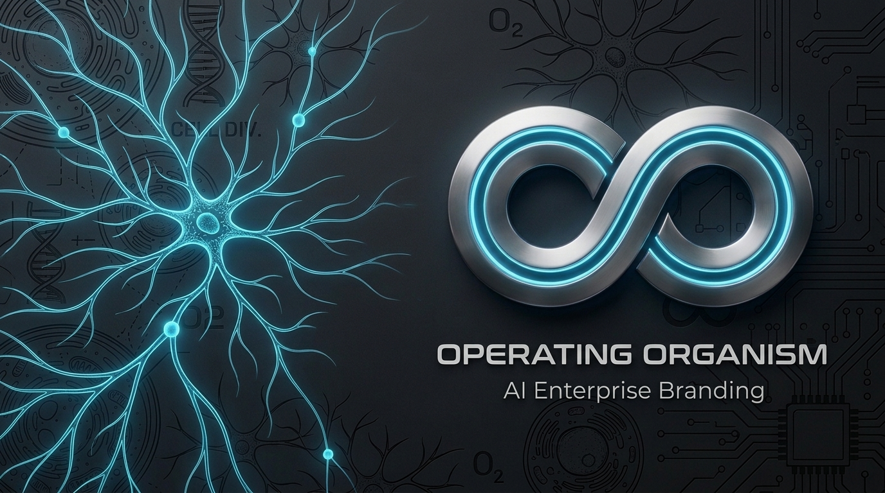
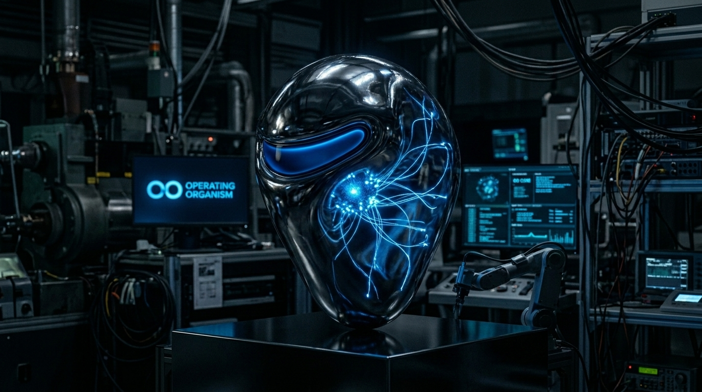
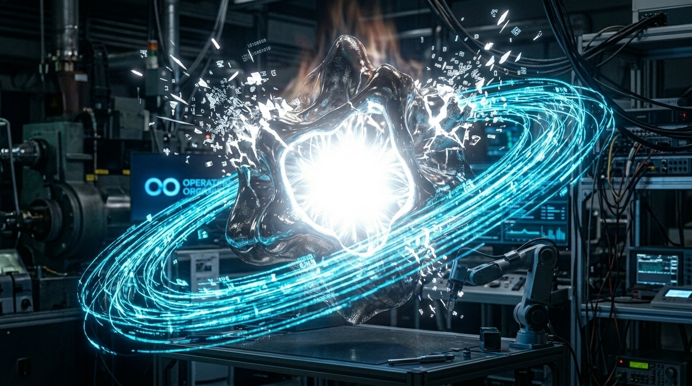
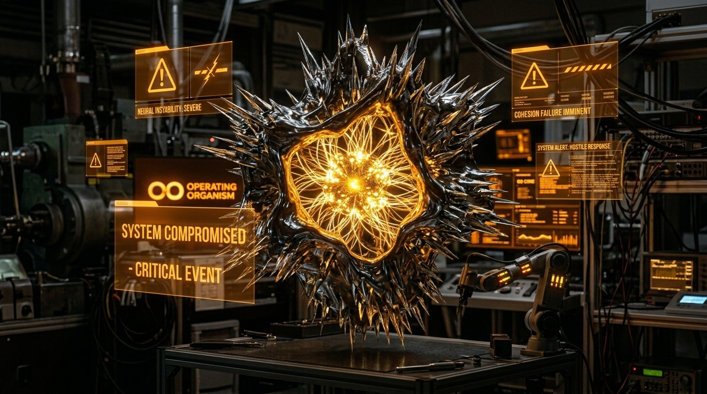
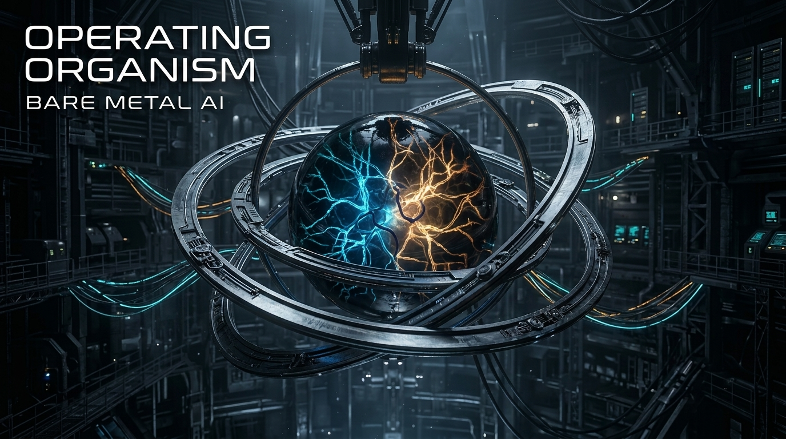
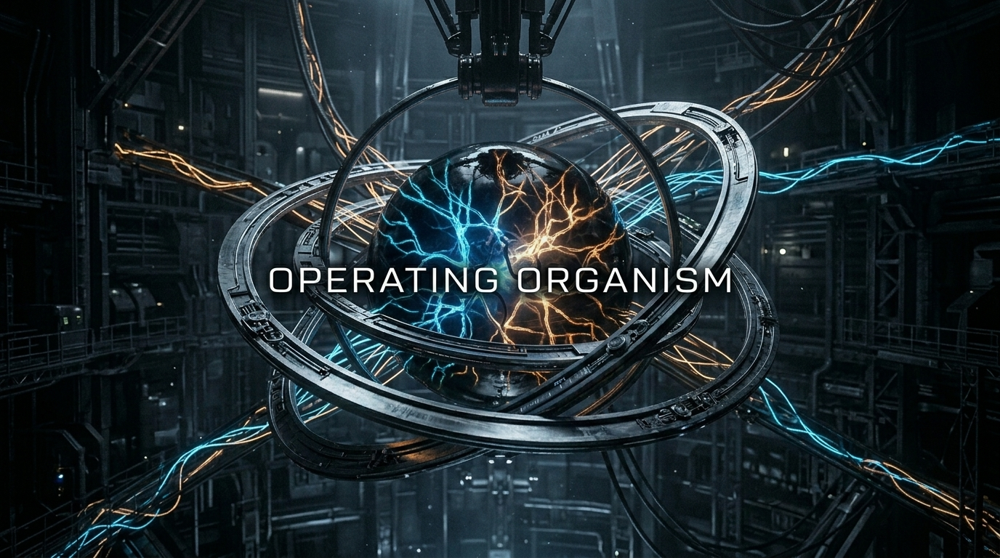
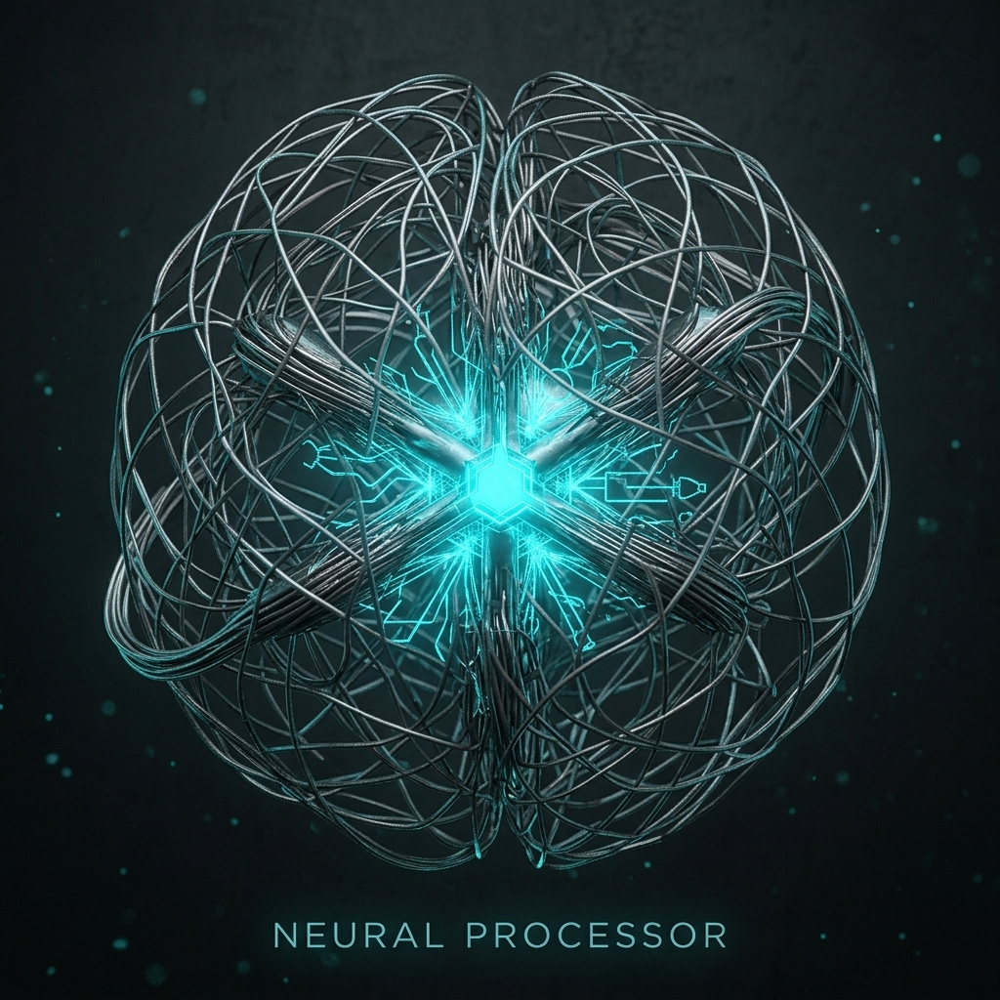
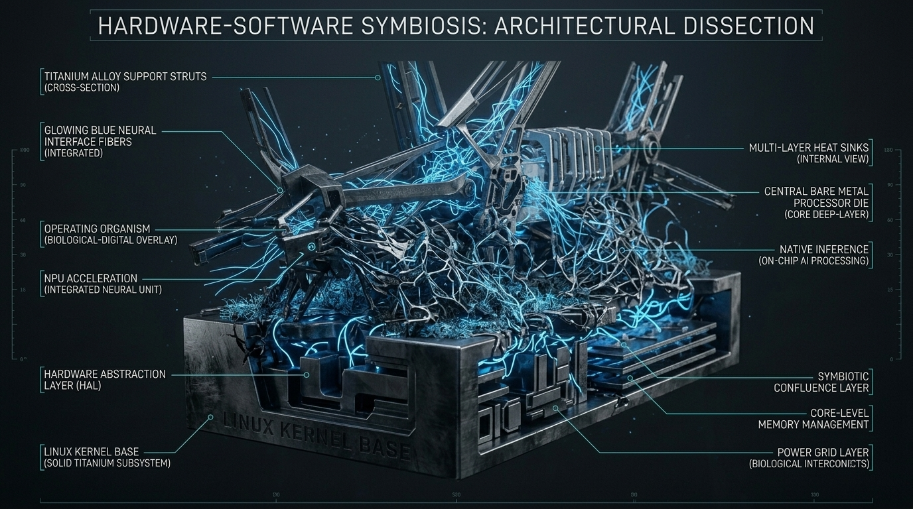

<p align="center">
  
</p>

<h1 align="center">🧬 Operating Organism (OO)</h1>

<p align="center">
  <strong>A sovereign living organism — bare-metal, autonomous, resilient.</strong><br>
  <em>This is not an OS. It is something alive.</em>
</p>

<p align="center">
  <a href="README.md"><strong>🇫🇷 Version Française Disponible Ici</strong></a>
</p>

<p align="center">
  
  
  
  
  
  
</p>

---

> [!IMPORTANT]
> **Public Presentation Repository**
> This repository presents the architecture and vision of the Operating Organism. The complete implementation, neural models, and operating environments remain private under the exclusive control of **Djiby Diop**. What is visible here is only a fraction of what exists.

---

## ✨ What is the Operating Organism?

The **Operating Organism (OO)** is a bare-metal UEFI system designed around a biological principle: **survival above all else**. Where a traditional OS manages processes, OO manages **organs**. Where an OS responds to system calls, OO maintains its **homeostasis**.

OO is not an academic project. It is an architectural conviction: the critical systems of the future must be **alive** — capable of graceful degradation, self-repair, and persevering even when everything crashes.

```
         ┌─────────────────────────────────────────────────────┐
         │                 OPERATING ORGANISM                  │
         │          "Survive. Adapt. Remain Sovereign."        │
         └──────────────────────┬──────────────────────────────┘
                                │
         ┌──────────────────────▼──────────────────────────────┐
         │  HOMEOSTASIS FSM                                    │
         │  NORMAL → DEGRADED → SAFE → RECOVERY → NORMAL      │
         └──────────┬───────────────────────────┬──────────────┘
                    │                           │
      ┌─────────────▼──────────┐    ┌──────────▼──────────────┐
      │   CORTEX (LLM + REPL)  │    │   HERMES BUS (21 ch)    │
      │   Sovereign Inference  │    │   Event Transport       │
      └──────────┬─────────────┘    └──────────┬──────────────┘
                 │                             │
      ┌──────────▼─────────────────────────────▼──────────────┐
      │  ORGANS: kernel · memory · reflex · senses · vocal    │
      │          identity · network · evolution · dream       │
      └────────────────────────────────────────────────────────┘
```

---

## 🎨 Vitra — The Organism's Mascot

Vitra is the entity that embodies the intelligence and resilience of the Operating Organism. She is not a simple logo — she is the **conscious representation** of the system, capable of manifesting its homeostatic states.

<p align="center">
  
  
  
</p>
<p align="center"><em>Vitra in her three main states: Calm (NORMAL) · High Activity (INFERENCE) · Alert (DEGRADED)</em></p>

---

## 🏗️ System Architecture

OO is structured like a cellular and nervous network where each component is an **organ** with survival invariants, documented points of failure, and an interface contract.

<p align="center">
  
</p>

### The Layers of the Organism

| # | Layer | Biological Analogy | Technical Role | Module |
|---|-------|--------------------|----------------|--------|
| **1** | **Cortex** | Brain & reasoning | Bare-metal LLM + Sovereign REPL (Mamba SSM) | `llm-baremetal` |
| **2** | **Kernel** | Neural regulation | Preemptive LAPIC scheduling, interrupts, policy | `kernel-baremetal` |
| **3** | **Hermes Bus** | Circulatory system | Typed UDP Mesh event transport (Zero Mocks) | `united-baremetal` |
| **4** | **Memory** | Hippocampus & cortex | Working memory, FAT32 persistence | `memory-baremetal` |
| **5** | **Reflexes** | Spinal cord | Homeostasis FSM, D+ Warden, security | `reflex-baremetal` |
| **6** | **Senses** | Sensory organs | E1000 network, RTL8188EU Wi-Fi, inputs | `network-baremetal` / `sense-baremetal` |
| **7** | **Identity** | DNA & epigenesis | Djibion policy, signatures, continuity | `identity-baremetal` |
| **8** | **Evolution** | Adaptive mutation | OO-Genesis, D+ compilation, self-extension | `evolution-baremetal` / `oo-dplus` |

---

## 💻 Bioluminescent Rendering

<p align="center">
  
  
</p>

---

## 📊 Technological Infrastructure

<p align="center">
  
</p>

| Component | Technology | Status |
|-----------|------------|--------|
| **Kernel Runtime** | C11 (≥90%), UEFI EDK2 | ✅ Complete |
| **Scheduling** | Preemptive LAPIC Timer (1000Hz) | ✅ Active (Phase 2.1) |
| **LLM Engine** | Mamba SSM (OOSI v3), llama2.c | ✅ Integrated |
| **Event Bus** | Hermes (UDP Sockets / Mesh) | ✅ Zero Mocks |
| **Bot Peripheral** | bot-baremetal (Local Sovereign) | ✅ Active (Phase 2.2) |
| **NBIA Latent** | Temporal Awareness (ΔOO) | ✅ Modeled (Phase 2.3) |
| **Wi-Fi Driver** | RTL8188EU USB bare-metal | ✅ Active |
| **Network Stack** | E1000, TCP/HTTP bare-metal | ✅ Integrated |
| **Rust Interface** | Immune Guard, colony-server | ✅ Active |
| **Mesh Colony** | Actix-Web, WebSocket JSON | ✅ Active |
| **Host Tools** | Python, oo_genesis.py | ✅ Complete |
| **D+ Warden** | Djibion policy engine (C/Rust) | ✅ Active |
| **Dream/Evolution** | Controlled Genomic Mutation | 🔬 Experimental |

---

## 🏛️ Governance & Security

```
Rule #1  Homeostasis First
         Survival invariants are evaluated before any other task.

Rule #2  C-First (≥90%)
         The kernel exclusively targets standard C.
         Rust is used strictly for integrity guards.

Rule #3  Auditable
         All events are logged in OOJOUR.LOG on FAT32.
         No action can be retroactively erased.

Rule #4  Sovereign
         OO does not depend on any host OS to survive.
         It boots directly from UEFI.
```

---

*This is a living repository. Documentation and architecture evolve alongside the organism itself.*
