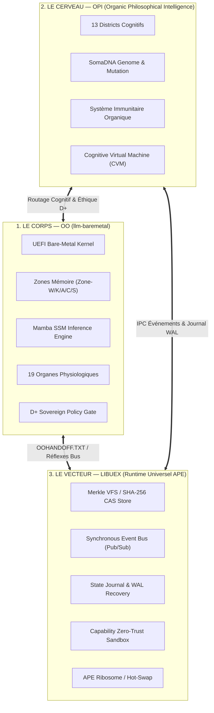
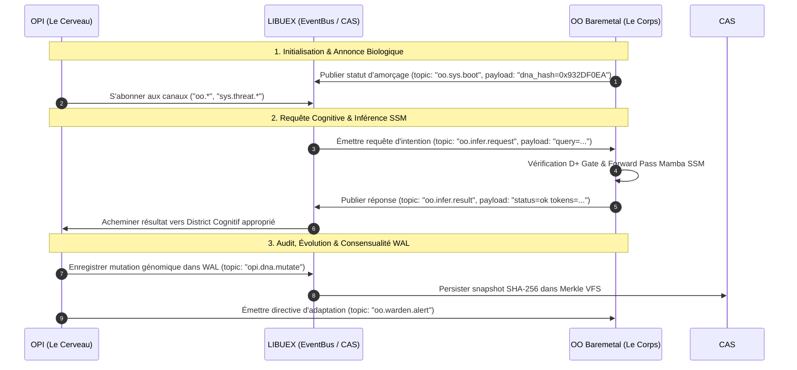

# LA TRINITÉ SOUVERAINE — SPÉCIFICATION ARCHITECTURALE v1.0
**Écosystème Organique Autonome : `OO` × `OPI` × `LIBUEX`**

---

## 1. Vision & Fondements Philosophiques

L'architecture souveraine repose sur une **trinité indissociable** où chaque dépôt remplit une fonction biologique et computationnelle distincte dans un organisme logiciel complet :

---

## 2. Rôle des Trois Piliers

### A. `OO` / `llm-baremetal` (Le Corps — Exécution Bare-Metal & Inférence)
- **Rôle principal** : Système d'exploitation et moteur d'inférence autonome fonctionnant sans OS conventionnel (boot direct UEFI).
- **Moteur neuronal** : Inférence **Mamba SSM** avec empreinte mémoire O(1) en longueur de séquence, optimisée par `DjibLAS` (AVX2/AVX512/SSE2).
- **Physiologie** : 19 organes coordonnés (Djibion, Evolvion, Conscience, Immunion, Thanatosion, etc.) avec contrôle éthique permanent via le portail **D+**.
- **Continuité d'identité** : Mémorisation entre reboots via `OO_DNA.bin` (personnalité cognitive) et `OOHANDOFF.TXT` (état souverain).

### B. `OPI` (Le Cerveau — Intelligence Philosophique Organique)
- **Rôle principal** : Superviseur cognitif, planificateur sémantique et gardien philosophique.
- **Topologie** : 13 districts spécialisés (Concept, Intent, Language, Planning, Shield, Verification, Math, etc.) reliés par un bus sémantique interne.
- **Résilience** : Capacité à simuler des scénarios (*Cognitive Virtual Machine*), détecter les anomalies comportementales et déclencher des réponses immunitaires automatiques.

### C. `libuex` (Le Vecteur — Runtime Universel Évolutif en APE)
- **Rôle principal** : Runtime portable et autonome basé sur Cosmopolitan Libc (`cosmocc`), capable de s'exécuter sur n'importe quel OS hôte ou bare-metal comme un binaire unique (*Actually Portable Executable*).
- **Les 6 Piliers** :
  1. **CAS SHA-256** : Stockage de contenu adressable (Merkle VFS / Git embarqué).
  2. **Event Bus** : Communication Pub/Sub synchrone avec matching par jokers (`*`, `?`).
  3. **State Journal WAL** : Journalisation à écriture anticipée et reprise de crash sans perte.
  4. **Capability Zero-Trust** : Sandbox granulaire par plugin (`pledge()` / `unveil()`).
  5. **Task Scheduler** : Ordonnanceur auto-guérisseur pour tâches asynchrones.
  6. **APE Ribosome** : Synthèse et chargement dynamique de modules à chaud.

---

## 3. Contrat d'Interface & Protocole de Symbiose Tripartite

L'interaction entre les 3 piliers s'effectue via un protocole standardisé en **3 couches d'échange** :

---

## 4. Matrice de Maturité & Statut de Validation Actuel

| Composant | Statut des Tests | Échantillons / Piliers Validés | Prochaine Étape Technique |
| :--- | :---: | :---: | :--- |
| **`libuex`** | **100% Validé** | **6 / 6 Piliers** (`test_uex.exe`) | Intégration d'un pont IPC partagé (`shm_open`) pour multi-binaires. |
| **`OPI`** | **100% Validé** | **21 / 21 Tests** + Symbiose | Connexion du *Semantic Bus* d'OPI à l'Event Bus de `libuex`. |
| **`OO` / `llm-baremetal`** | **100% Validé** | **13/13 Mamba** + **9/10 Phase W** (61 concepts) | Déploiement d'une démo d'orchestration tripartite hôte/baremetal. |

---

## 5. Prochaines Étapes Opérationnelles (Feuille de Route)

1. **Phase 1 : Le Pont Tripartite (`trinite_runtime_bridge.c`)**
   - Implémenter un connecteur unifié qui permet à une instance `libuex` d'encapsuler et de piloter à la fois un moteur `OPI` en espace utilisateur et un nœud `OO` (via QEMU série ou interface hôte).
2. **Phase 2 : Auto-Évolution & Merkle VFS (CAS + Evolvion)**
   - Connecter le moteur `evolvion` (auto-génération de code) et `immunion` de `OO` au CAS SHA-256 de `libuex` pour archiver de façon cryptographique chaque mutation du noyau.
3. **Phase 3 : Essai en Vol Réel Bare-Metal**
   - Lancer le démonstrateur unifié en QEMU et vérifier la persistance inter-sessions via `OOHANDOFF.TXT` et `OO_DNA.bin`.
