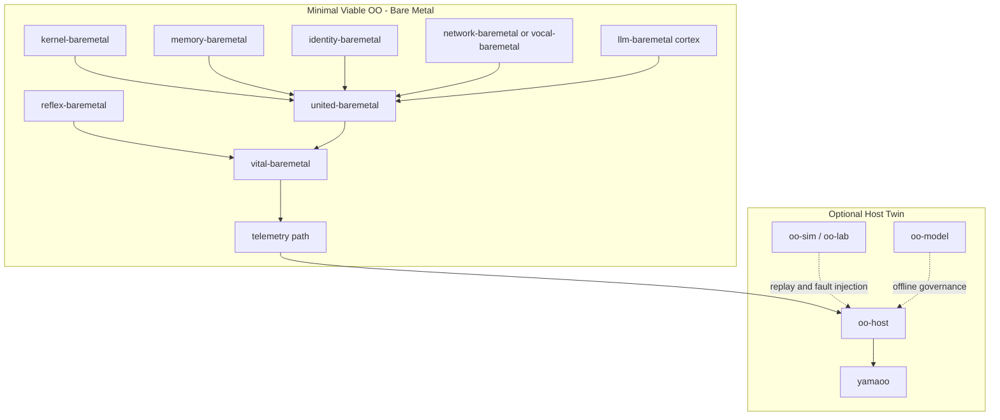

# OO Architecture

This is the canonical short architecture for OO. `README.md` remains the operator entry point. Older files such as `OO_ORGAN_CATALOG.md`, `OO_CONTROL_PLANES.md`, `OO_HOMEOSTASIS_INVARIANTS.md`, and `OO_CROSS_ORGAN_FLOWS.md` are detailed annexes when they do not contradict this file.

## A. System philosophy

OO is a survival-first operating organism. It is not a desktop OS, not a cloud platform, and not uncontrolled AI autonomy.

The system is built around:

- A sovereign bare-metal runtime: `llm-baremetal` plus the minimal vital organs.
- A host-side twin: `oo-host`, yamaoo, lab tooling, simulation, replay, and administration.
- Persistent memory and auditability: journals, state snapshots, invariants, and reproducible artifacts.
- Governed autonomy: explicit policy gates, bounded control planes, reversible actions, and documented ownership.

The first proof is not "all organs doing everything". The first proof is a small organism that boots, initializes deterministically, preserves its vital chain, exposes telemetry, and can recover from non-vital failure without collapsing.

## B. Architecture diagram



## C. Repository structure

Core runtime repositories or directories:

- `llm-baremetal`: UEFI runtime and cortex lane.
- `kernel-baremetal`: execution and scheduler boundary.
- `united-baremetal`: typed event circulation.
- `memory-baremetal`: working and persistent memory continuity.
- `reflex-baremetal`: immediate survival and preemption.
- `vital-baremetal`: homeostasis mode state machine.
- `identity-baremetal`: DNA/self identity and integrity anchor.
- `network-baremetal` and `vocal-baremetal`: telemetry and communication paths, tiered by hardware readiness.

Support lanes:

- `oo-host`: host twin and state orchestration.
- `yamaoo`: optional interface for visualization, replay, and administration.
- `oo-sim`, `oo-lab`: simulation, experiments, failure injection.
- `oo-model`: offline model governance, data, and validation.
- `oo-dplus`: language and policy experimentation, not a survival dependency until proven.
- `oo-system`: integration contracts and cross-lane specifications.

Repository tiers:

| Tier | Purpose | Rule |
|---|---|---|
| `public` | Minimal auditable core and docs | Must build or validate with documented commands |
| `private` | Secrets, hardware lab notes, sensitive datasets | Must never be required for public survival build |
| `incubation` | Experimental organs, drivers, model ideas | Must have exit criteria before becoming core |
| `archive` | Historical docs, replaced scripts, abandoned copies | Read-only reference; not part of build |

### Workspace classification

| Path | Tier | Reason |
|---|---|---|
| `llm-baremetal` | `core` | Sovereign runtime and cortex lane; must degrade without breaking vitals |
| `kernel-baremetal` | `core` | Execution and scheduling boundary |
| `united-baremetal` | `core` | Typed event circulation |
| `memory-baremetal` | `core` | Journal and state continuity |
| `reflex-baremetal` | `core` | Immediate survival preemption |
| `vital-baremetal` | `core` | Homeostasis mode state machine |
| `identity-baremetal` | `core` | Identity, hash, and trust anchor |
| `network-baremetal` | `core` | Tiered telemetry transport; must fall back cleanly |
| `vocal-baremetal` | `core` | Minimal operator/UART-style fallback telemetry |
| `sense-baremetal` | `optional` | Input normalization outside the vital chain |
| `proprioception-baremetal` | `optional` | Body posture and resource awareness |
| `regen-baremetal` | `optional` | Repair procedures after invariants exist |
| `shadow-baremetal` | `optional` | Boundary/defense lane until merged into `IntegrityGuard` |
| `dream-baremetal` | `experimental` | Replay/consolidation, not online mutation |
| `evolution-baremetal` | `experimental` | Mutation workflow, blocked from core until governed |
| `swarm-baremetal` | `experimental` | Distributed/colony behavior, not required for single-node survival |
| `bot-baremetal` | `experimental` | Immune-agent ideas must merge into `IntegrityGuard` or be removed |
| `oo-host` | `optional` | Host twin and replay/administration support |
| `yamaoo` | `optional` | UI and observability only |
| `oo-system` | `optional` | Integration specs, validation scripts, and shared contracts |
| `oo-sim` | `optional` | Simulation and fault injection lane |
| `oo-lab` | `experimental` | Prototype and incubation lane |
| `oo-model` | `optional` | Offline model governance and export tooling |
| `oo-dplus` | `experimental` | Language/policy experiment until promoted by reproducible gates |
| `control-planes` | `optional` | Control-plane contracts and indexes, not a boot dependency |
| `llm.c`, `llama2.c` | `archive` | Upstream/reference zones unless explicitly vendored by contract |

## D. Build system design

Current operator commands:

```powershell
pwsh ./oo-build.ps1 -SkipQemu
pwsh ./tools/scripts/smoke_baremetal.ps1 -FailOnMissing -FailOnStrictMissing
```

Release/image creation currently uses the existing image helper from WSL:

```powershell
wsl -e bash ./llm-baremetal/tools/scripts/make-boot-img.sh
```

Target doctrine:

- Build: one command validates the core build path.
- Test: one command validates the structural and runtime smoke path.
- Release: one command produces the boot image plus provenance/checksum artifacts.
- Current release helper: `llm-baremetal/tools/scripts/make-boot-img.sh`.
- Missing hardening: a checksum/provenance wrapper around image creation.

Target graph:

```text
organ sources -> organ objects -> liboo-all.a -> llm-baremetal cortex -> EFI/image -> smoke/release artifact
```

Rules:

- The root `Makefile` owns the freestanding organ archive contract.
- `llm-baremetal/Makefile` consumes `liboo-all.a` rather than hidden worktrees.
- `oo-build.ps1` is the operator validation front door on Windows.
- A future release orchestrator may wrap image creation, but must not hide required source dependencies.
- Release artifacts must include checksums and enough provenance to reproduce the image.

## E. Organ structure

Every surviving organ must expose:

- Owner.
- Inputs.
- Outputs.
- Invariants.
- Failure mode.
- Test or validation method.

### Classification

| Module | Tier | Owner role | Inputs | Outputs | Core invariant | Failure mode |
|---|---|---|---|---|---|---|
| `kernel-baremetal` | `core` | Runtime execution owner | boot state, interrupts, scheduled work | bounded execution | vital work must run | enter `SAFE`, stop non-vital work |
| `united-baremetal` | `core` | Circulation owner | typed events | ordered dispatch | event bus remains bounded | backpressure, drop non-vital events |
| `memory-baremetal` | `core` | Continuity owner | state, journals | durable records | vital state remains readable | minimal journal, isolate writers |
| `reflex-baremetal` | `core` | Survival owner | invariant breaches | immediate actions | reflex path preempts strategy | reflex-only profile |
| `vital-baremetal` | `core` | Homeostasis owner | health metrics | mode transitions | one valid mode at all times | `SAFE` or `RECOVERY` |
| `identity-baremetal` | `core` | Identity owner | hardware/hash inputs | identity/DNA hash | self identity is stable | deny high-risk actions |
| `network-baremetal` | `core` | Telemetry owner | packets/events | telemetry frames | telemetry must not block survival | fallback to `vocal-baremetal`/UART |
| `vocal-baremetal` | `core` | Operator communication owner | vital status | UART/report output | diagnostic path remains simple | reduced text telemetry |
| `llm-baremetal` | `core` | Cortex owner | context, memory, events | thoughts/plans | cortex may degrade without killing vital chain | offline cortex, survival continues |
| `sense-baremetal` | `optional` | Ingest owner | external inputs | normalized observations | bad input cannot touch vital path | disable input route |
| `proprioception-baremetal` | `optional` | Body-awareness owner | stack/heap posture | posture alerts | posture checks stay bounded | warning, then degraded mode |
| `regen-baremetal` | `optional` | Repair owner | snapshots, faults | repair actions | repair must be reversible | disable repair, keep snapshot |
| `shadow-baremetal` | `optional` | Boundary owner | ingress/trust signals | quarantine alerts | boundary does not block vital chain | isolate route |
| `dream-baremetal` | `experimental` | Replay owner | journals | consolidation output | no online mutation in core path | archive/replay only |
| `evolution-baremetal` | `experimental` | Mutation governance owner | variants, tests | candidate changes | no uncontrolled self-modification | incubation only |
| `swarm-baremetal` | `experimental` | Distributed owner | peer signals | colony state | no dependency for single-node survival | disable swarm |
| `bot-baremetal` | `experimental` | Immune-agent owner | anomaly signals | patrol actions | must merge into `IntegrityGuard` if kept | remove duplicated agents |

Merge direction:

- Merge `bot-baremetal` and overlapping `shadow-baremetal` ideas into one `IntegrityGuard` contract before either becomes core.
- Merge recovery overlap between `regen-baremetal` and `dream-baremetal` until there is a measurable split.
- Keep swarm, evolution, and dream outside the Minimal Viable OO.

## F. Language policy summary

See `LANGUAGE_POLICY.md` for the full policy.

Short version:

- `C`: at least 90% of project-owned source; core freestanding runtime and organ APIs.
- `Assembly`: only CPU/boot/interrupt boundaries.
- `Rust`: bounded support language inside the shared 10% Rust/C++ ceiling.
- `C++`: bounded support language inside the shared 10% Rust/C++ ceiling.
- `Python`, `TypeScript`, PowerShell, and shell: temporary or optional support/orchestration only, never survival-chain growth languages.

## G. Governance model summary

See `CONTRIBUTING.md` for the full contribution model.

Non-negotiables:

- Every major change needs an architecture decision note.
- Every new subsystem must pay rent or remove complexity elsewhere.
- Bare-metal core changes require build and smoke validation.
- Host-side convenience must not become a hidden core dependency.

## H. Long-term evolution strategy

OO survives 20+ years by separating stable contracts from experimental ambition.

Phases:

1. Freeze doctrine and classify modules.
2. Build Minimal Viable OO.
3. Make build/test/release deterministic.
4. Validate survival modes under fault injection.
5. Connect yamaoo as optional observability.
6. Promote only proven experiments into core.

## I. Top 20 mistakes to avoid

1. Letting the biological metaphor define implementation boundaries.
2. Making yamaoo required for bare-metal survival.
3. Keeping duplicate worktrees as implicit dependencies.
4. Adding languages without a bounded role.
5. Building network autonomy before survival invariants are stable.
6. Treating the cortex as vital when the vital chain must survive without it.
7. Adding organs without owners.
8. Adding organs without tests.
9. Keeping docs that contradict the canonical architecture.
10. Hiding generated artifacts as source requirements.
11. Accepting non-reproducible local build tricks.
12. Overusing dynamic allocation in the vital path.
13. Mixing experimental mutation with production runtime.
14. Allowing policy bypass for convenience.
15. Ignoring failure modes for optional modules.
16. Making the release process manual and undocumented.
17. Expanding public repositories with private secrets or hardware-specific assumptions.
18. Treating QEMU success as proof of real-hardware readiness.
19. Letting telemetry block control ticks.
20. Keeping code because it is emotionally important rather than operationally measurable.

## J. What Justine Tunney would likely criticize

- Too many directories and names for a system that does not yet have a tiny reproducible core.
- Hidden complexity in build scripts and historical worktrees.
- Portability risk if the system depends on one host setup, one shell, or one undocumented artifact.
- Over-abstraction through biological naming instead of plain engineering contracts.
- Large ambition before a minimal, boring, fast, reproducible executable exists.
- Network and AI complexity before the boot path, build path, and failure semantics are simple.

The response is not to abandon ambition. The response is to make the foundation small enough to audit.

## K. What allows OO to survive for 20+ years

- A small core that can be explained quickly.
- Strict separation between core, optional support, experiments, and archive.
- Deterministic build/test/release commands.
- Stable organ contracts with owners and failure modes.
- Ruthless deletion of duplicate scripts and docs.
- Plain ASCII-friendly operational files.
- Audit trails for architecture decisions.
- A culture that treats complexity as debt, not progress.
